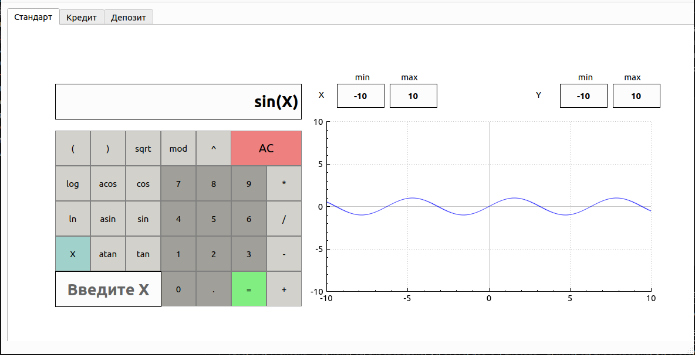
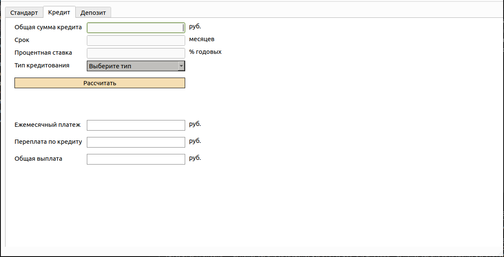
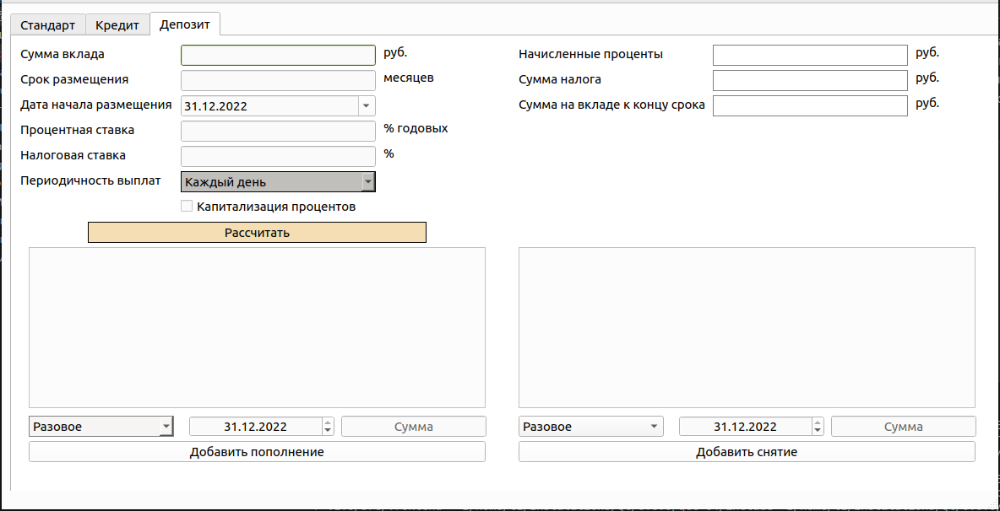

# Умный калькулятор
В данном проекте на языке программирования Си с использованием структурного подхода реализована расширенная версия обычного калькулятора, который можно найти в стандартных приложениях каждой операционной системы. Помимо базовых арифметических операций, как плюс-минус и умножить-поделить, калькулятор имеет возможность вычисления арифметических выражений с учетом приоритетов, а так же некоторыми математическими функциями (синус, косинус, логарифм и т.д.). Помимо вычисления выражений калькулятор так же должен поддерживает использование переменной _x_ и построение графика соответствующей функции. В качестве дополнительных возможностей калькулятор имеет кредитный и депозитный режимы.

    - **Арифметические операторы**:

        | Название оператора | Инфиксная нотация   (Классическая) | Префиксная нотация   (Польская нотация) |  Постфиксная нотация   (Обратная польская нотация) |
        | ------ | ------ | ------ | ------ |
        | Скобки | (a + b) | (+ a b) | a b + |
        | Сложение | a + b | + a b | a b + |
        | Вычитание | a - b | - a b | a b - |
        | Умножение | a * b | * a b | a b * |
        | Деление | a / b | / a b | a b \ |
        | Возведение в степень | a ^ b | ^ a b | a b ^ |
        | Остаток от деления | a mod b | mod a b | a b mod |
        | Унарный плюс | +a | +a | a+ |
        | Унарный минус | -a | -a | a- |

    - **Функции**:
  
        | Описание функции | Функция |   
        | ---------------- | ------- |  
        | Вычисляет косинус | cos(x) |   
        | Вычисляет синус | sin(x) |  
        | Вычисляет тангенс | tan(x) |  
        | Вычисляет арккосинус | acos(x) | 
        | Вычисляет арксинус | asin(x) | 
        | Вычисляет арктангенс | atan(x) |
        | Вычисляет квадратный корень | sqrt(x) |
        | Вычисляет натуральный логарифм | ln(x) | 
        | Вычисляет десятичный логарифм | log(x) |

### Польская прямая и обратная нотации

Несмотря на безусловное удобство работы с классической формой записи выражений при ручном счёте, при написании программ запросы чаще всего формируются в формате `что делать -> с какими данными совершать операции`. Так, примерно в 1920 Польский логик Ян Лукасевич изобрел префиксную нотацию (в последствии также называемую польской нотацией или прямой польской нотацией) с целью упрощения пропозиционной логики.

Рассмотрим способы написания выражений:

Выражение, написанное в классической (инфиксной) нотации:

>2 / (3 + 2) * 5

Выражение, написанное в польской (префиксной) нотации:

>\* (/ 2 (+ 3 2)) 5

Как правило скобки между операциями с одинаковым приоритетом опускаются и итоговая запись выглядит следующим образом:

>\* / 2 (+ 3 2) 5

Польская нотация получила широкое распространение в области вычислительных систем, в частности она используется во многих стековых языках, таких как PostScript, и долгое время являлась основой для многих вычислительных машин (калькуляторов).

В середине 1950-х австралийским философом и специалистом в области теории вычислительных машин Чарльзом Хэмблином была разработана обратная польская нотация (ОПН). Работа Хэмблина была представлена на конференции в июне 1957, и издана в 1957 и 1962.

Первыми компьютерами, поддерживающими обратную польскую нотацию, были KDF9 от English Electric Company, анонсированные в 1960 и выпущенные в 1963, и американский Burroughs B5000, анонсированный в 1961, выпущен в том же 1963. 

Компания Friden перенесла ОПН в настольные калькуляторы, выпустив в июне 1964 модель EC-130. А в 1968 инженеры Hewlett-Packard разработали настольный калькулятор 9100A с поддержкой ОПН. Этот калькулятор сделал обратную польскую нотацию популярной среди учёных и инженеров, даже несмотря на то, что в ранней рекламе 9100A ОПН не упоминалась. В 1972 калькулятор HP-35 с поддержкой ОПН стал первым научным карманным калькулятором.

ОПН применялась в советском инженерном калькуляторе Б3-19М (совместная разработка с ГДР), выпущенном в 1976 году. Все выпускаемые в СССР вплоть до конца 1980-х годов программируемые микрокалькуляторы, за исключением «Электроника МК-85» и «Электроника МК-90», использовали ОПН — она проще реализовывалась и позволяла при программировании обходиться меньшим числом команд, в сравнении с обычной алгебраической нотацией (количество программной памяти в моделях того времени всегда было критическим ресурсом). ОПН использовалась в российских программируемых калькуляторах «Электроника МК-152» и «Электроника МК-161», обеспечивая их совместимость с программами, написанными для советских калькуляторов. 

Обратная польская нотация имела все преимущества прародителя, позволяя сократить объём выражений благодаря отсутствию необходимости в скобках. Это позволяло сократить число команд при написании компьютерных программ. Благодаря этому свойству, обратную польскую нотацию также иногда называют обратной бесскобочной записью.

Пример выражения, написанного в обратной польской (бесскобочной) нотации:

> 2 3 2 + / 5 *

### Алгоритм Дейкстры

Эдсгер Дейкстра изобрёл алгоритм для преобразования выражений (в том числе функций) из инфиксной в обратную польскую нотацию. Алгоритм получил название «сортировочная станция», за сходство его операций с происходящим на железнодорожных сортировочных станциях. 

>Перед рассмотрением самого алгоритма сделаем небольшую ремарку и введём понятие лексемы. Лексемой будет называться простейшая единица морфологического разбора выражения. Так, разбитое на лексемы выражение 2 / (3 + 2) * 5 (пробелы добавлены для более удобного восприятия и не несут семантического смысла), будет выглядеть следующим образом: [2], [/], [(], [3], [+], [2], [)], [*], [5], где [2, 3, 5] - числовые лексемы, [/, (, +, ), *] - лексемы-операции.

Алгоритм сортировочной станции основан на стеке. В преобразовании участвуют две текстовых переменных: входная и выходная строки. В процессе преобразования используется стек, хранящий ещё не добавленные к выходной строке операции. Преобразующая программа последовательно считывает лексемы из входной строки, выполняя на каждом шаге некоторые действия, зависящие от того, какая лексема была считана.

#### Реализация алгоритма

Пока в исходной строке есть необработанные лексемы, считываем очередную:

Если лексема:
- Число - добавляем в строку вывода.
- Функция или открывающая скобка - помещаем в стек.
- Разделитель аргументов функции (например, запятая):         
    - Перекладываем операторы из стека в выходную очередь пока лексемой на вершине стека не станет открывающая скобка. Если в стеке не окажется открывающей скобки - в выражении допущена ошибка.
- Оператор (O1):
    - Пока присутствует на вершине стека лексема-оператор (O2) чей приоритет выше приоритета O1, либо при равенстве приоритетов O1 является левоассоциативным:
        - Перекладываем O2 из стека в выходную очередь.
    - Помещаем O1 в стек.
- Закрывающая скобка:
    - Пока лексема на вершине стека не станет открывающей скобкой, перекладываем лексемы-операторы из стека в выходную очередь.
    - Удаляем из стека открывающую скобку.
    - Если лексема на вершине стека — функция, перекладываем её в выходную очередь.
    - Если стек закончился до того, как была встречена открывающая скобка - в выражении содержится ошибка.

Если во входной строке больше не осталось лексем:
- Пока есть операторы в стеке:
    - Если на вершине стека скобка - в выражении допущена ошибка.
    - Перекладываем оператор из стека в выходную очередь.

## Дополнительно. Кредитный калькулятор

 - Вход: общая сумма кредита, срок, процентная ставка, тип (аннуитетный, дифференцированный)
 - Выход: ежемесячный платеж, переплата по кредиту, общая выплата

## Дополнительно. Депозитный калькулятор

 - Вход: сумма вклада, срок размещения, процентная ставка, налоговая ставка, периодичность выплат, капитализация процентов, список пополнений, список частичных снятий
 - Выход: начисленные проценты, сумма налога, сумма на вкладе к концу срока

### Язык проекта - С, C++(QT)
### Использованные технологии:
- Библиотека разработана на языке Си стандарта C11
- Предусмотрен Makefile для сборки библиотеки и тестов (с целями all, install, uninstall, clean, dvi, dist, test, gcov_report) 
- Библиотека тестов - Check
- В цели gcov_report формируется отчёт lcov в виде html страницы.
- Реализация с графическим пользовательским интерфейсом, на базе Qt
- Проверяемая точность дробной части - 7 знаков после запятой

### Требуемые доработки
Оформляя данный проект следовало бы перенести всю логику на С однако я в тот момент не был знаком с MVC, плюс писать логику кредитного и депозитного калькулятора было гораздо проще на QT. В следующей версии калькулятора этого недостатка нет.